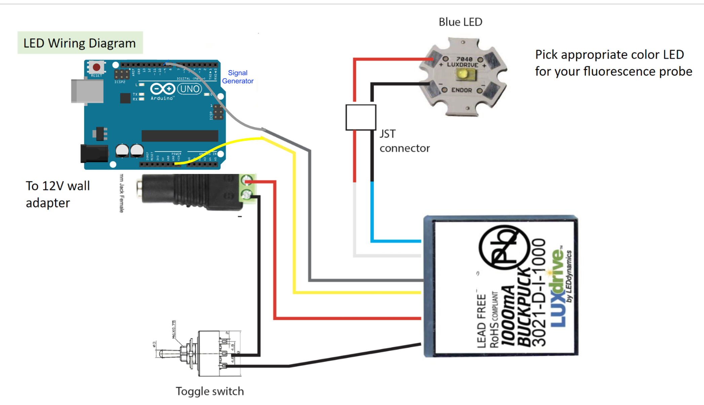

# About
User interface utilizing Arduino that controls an LED driver to accurately control flashes. The Arduino is connected to a computer and the UI is controlled with the keyboard and mouse.  
# Installation
Download the and unzip the repo.
# Set up
Connect as depicted in the image below:

To run, please double click the LightStim.bat file. The output text and video should both appear in the same LightStim folder. Be warned, the bat file will not run correctly if the Arduino is not connected to the serial interface to your computer.
# Cross Compatibility
This project was designed on Windows. With Mac, just change the any file path to "/" instead of "\" and the bat should still run correctly. 